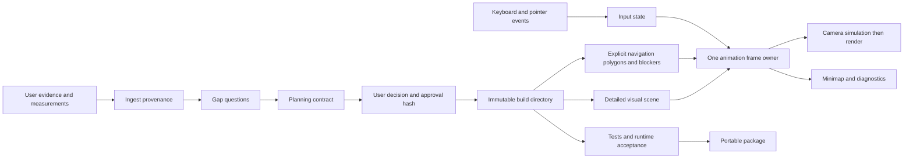

# Architecture

The maintained runtime extracts the detailed Pearl scene from V7 while replacing
its operating layer. The preserved upstream snapshot is evidence, not the default
entry point. The generic procedural adapter consumes the same planning contract;
it does not claim to reconstruct a photographic room automatically.

## Contracts and gates

`schemas/` documents the planning and build data. The CLI validates semantic
constraints as well as types: dimensions, spawn, route reachability, player
clearance and approval identity. Raster dimensions are not measurements. Intake
must establish scale, axes and conflicting references before a plan is locked.

The plan is reviewable before approval. A lock binds the plan and evidence state.
Builds are separately identified from the approved plan: a source change produces
a new build even when the user's layout has not changed. Changing uploaded evidence
or answers invalidates the old approval. Keep validation reports tied to build
identity; a successful test of another port or build is not acceptance evidence.

## Visual scene

`runtime/scene-pearl.js` retains V7 furniture, materials, lights, labels and shell
construction. Its own visual bookkeeping cannot decide whether the player moves.
The inherited `desk()` return defect and the floor's coordinate reflection are
corrected in the maintained scene. The historical snapshot is kept unchanged.

World coordinates are X/Z in the plan, with Y up, in metres. A 2D Three Shape uses
X/Y before rotation, so its second coordinate must be negated before rotating
minus 90 degrees to produce the intended X/Z footprint and upward normals.
Double-sided materials alone do not fix a reflected floor.

Pearl is a procedural detailed scene, not a supplied photogrammetry or textured
production GLB. The floor-plan PNG is evidence/reference rather than a measured
navigation surface. The maintained minimap uses runtime coordinates to avoid the
original image-cropping offset being mistaken for accurate localization.

## Navigation

Explicit walkable regions and structural blockers are authoritative. Navigation
never sweeps every chair or prop mesh. The player radius and small movement
substeps prevent boundary penetration; independent axis trials provide sliding.
Connectivity is evaluated from the spawn to required destinations with clearance.
This is a single-floor 2D navigation model, not a general multilevel physics engine.

The Pearl adapter preserves V7's intentionally permissive treatment of room
partitions/furniture. The exterior and central glass boundary remain barriers.
Walking through a decorative partition is a documented baseline limitation, not
evidence of collision parity. A stricter room needs an explicit reviewed blocker
manifest and door destinations; adding all visual colliders is not the solution.

## Input and rendering

Key normalization supports code, key and legacy numeric events. Focus is returned
to the canvas on entering or dragging. Blur, page hide, visibility loss and pointer
cancellation clear transient state. Physical and virtual controls feed movement
without requiring pointer lock. Event callbacks accumulate input only.

One requestAnimationFrame owner consumes look deltas, advances movement and camera,
updates secondary UI at a lower rate, and renders. Reset, resize and quality changes
update state rather than starting another render chain. Diagnostics separate raw
events, normalized held keys, coordinates, simulation ticks and rendered frames.
Frame counts do not prove the OS compositor displayed them; real browser tests do.

## Local serving and rollback

The launcher binds its own loopback socket to an available port before opening the
URL. It does not kill unknown processes or assume that a familiar port is the right
server. Local responses use no-store headers. Build-specific directories, a URL
build expectation, manifest hashes and a visible badge make stale sessions evident.
Dependencies are vendored and version-pinned. No service worker is installed.

Rollback is supported through previously verified playable ZIPs. Keep each release
package; extract the desired version into a separate folder and run its own
`python3 launch.py`. The standalone launcher checks that package's integrity,
binds a fresh loopback port and opens its exact build URL. Compare the badge with
the retained package's manifest before testing. This replays the historical build
without altering the active project's plan or approval.

Stored project build directories are retained as history. The CLI's `play` and
`package` commands target the current build for the currently locked plan; they do
not expose a selector for historical builds. To resume development on an older plan,
initialize a separate project workspace, restore/re-ingest its plan and evidence,
complete the intake, review the plan and record a new approval before building.
The result uses the current runtime; it is not an exact replay of the historical
package. Packaging copies the current build's exact
runtime and manifest rather than a symlink to mutable project files.

## Extension boundaries

Add an asset importer or Blender exporter through the visual adapter. A new importer
must preserve provenance, transforms and mesh/texture budgets and be tested against
the locked plan. It must not silently rebuild navigation from imported geometry.
No paid API is called by this repository. The skill is a local orchestration layer,
not a cloud reconstruction service or headset WebXR implementation.
