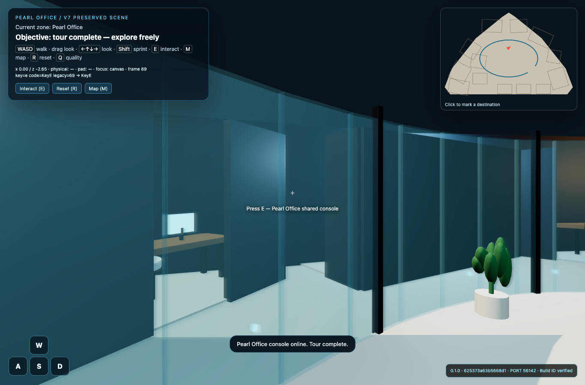

# Release validation — 0.1.0

This page preserves the original release evidence. For the later local repairs,
53 Python / 19 JavaScript tests, new-user delivery loop and Blender compatibility
checks, read the [2026-10-04 local audit](local-audit-2026-10-04.md) and
[2026-10-05 onboarding follow-up](onboarding-review-2026-10-05.md). The original
results below do not describe the current modified build.

Delivery recorded on **2026-10-02 (Asia/Tokyo)**. These results apply to the
delivered source and the Pearl build **`625373a63b5668d1`**. Tests used macOS,
Python 3.9, Node 24.19.0 and installed Google Chrome 154.0.8037.92 in headless
automation. The documented Python minimum remains 3.10 for public users.

| Check | Result and evidence |
|---|---|
| Eleven input archives | Inventoried all members and SHA-256 values; compared every adjacent game package and produced nine normalized runtime diffs. See [source evidence](evidence/). |
| CLI/contracts | **33 Python tests passed**: intake, approval invalidation, geometry, asset handling, integrity, serving and packaging. |
| Runtime regressions | **13 Node tests passed**: Safari event normalization, focus/hold clearing, navigation union, sliding/barriers, route continuity, stale identity, retained scene, floor winding/orientation and GLB constraints. |
| Pearl navigation | All **7,064** sampled navigation cells form one connected component; 14 area access points and six required route points are reachable. The runtime route test also checks the approved walk at 3.5 cm spacing. |
| Pearl browser smoke | **Passed** on the delivered build. W/A/S/D each caused displacement; dragging changed yaw and rendered pixels; virtual input released correctly outside the button. Reception → wine → central-console interactions completed. |
| Render/identity | Browser smoke found one render per recorded frame, no page errors and no external requests. Wrong build URL returned HTTP 409; responses used no-store. Enter becomes available only after local models load and the first renderer call succeeds. |
| Detailed scene | Browser reported **473 meshes and 13 interactables**. The source regression additionally verifies retained detailed scene construction, including the corrected console object and upward floor. |
| Optional imported model | A separate authored triangle GLB fixture loaded successfully before entry, with one imported model/mesh; hash verification, movement and browser smoke passed. Fixture build: `d929e0028518f6c9`. This proves the import path, not a high-detail custom reconstruction. |
| Blender audit helper | Blender 5.2.2 ran the audit against a generated plane: upward floor passed; reversed floor failed as expected. No claim is made that the older companion builder reproduces the full browser scene. |
| Standalone playable ZIP | Extracted and launched with `python3 launch.py --no-open`: fresh loopback server, matching build/port, no-store, stale URL rejection and license files passed. A deliberately modified extracted runtime was rejected before serving. |
| GitHub Actions | Workflow is included. Remote CI has **not** run; local results are the executed evidence. |

Machine-readable browser evidence: [Pearl report](validation/pearl-browser.json)
and [GLB-fixture report](validation/glb-browser.json). The reported ports were
temporary test ports; launchers allocate a new one each time.



## Safari acceptance remains separate

An installed Safari window displayed the detailed scene during a manual attempt
on the preceding build `246b9845abb75bc7`. Initial entry also showed a blank canvas
and zero frames before the scene later appeared. The automation surface then failed
to deliver dependable sustained keyboard/drag input, reporting unavailable windows.
The evidence does not isolate a Safari rendering defect from background-window or
automation behavior.

The delivered build adds a first-frame readiness gate, verified in Chrome. This
prevents entry while initialization is still incomplete; a successful WebGL render
call alone cannot certify macOS compositor presentation. **Physical Safari WASD,
continuous drag while walking, and focus recovery remain unverified on the final
build.** Follow [browser acceptance](browser-validation.md) on the recipient's Mac
and record the actual badge, browser version and observed motion. Playwright
Chromium or WebKit is not a substitute for this acceptance.

## Reproduce

```sh
python3 -m unittest discover -s tests -p 'test_*.py'
node --test tests/runtime*.mjs
python3 scripts/quickstart.py --build-only
npm install --ignore-scripts
npx playwright install chromium
python3 scripts/run_browser_smoke.py
```

For installed Chrome, set `BROWSER_EXECUTABLE` instead of installing Chromium.
The browser wrapper owns and closes its local server. Generated projects, test
reports and optional dependencies are ignored by Git; the reports and screenshot
above are deliberately retained release evidence. New projects still require
their own measurements, plan approval, model review and browser acceptance.
