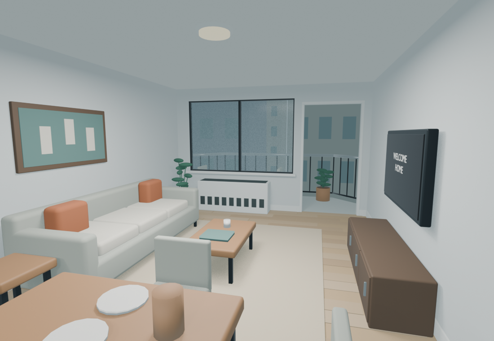
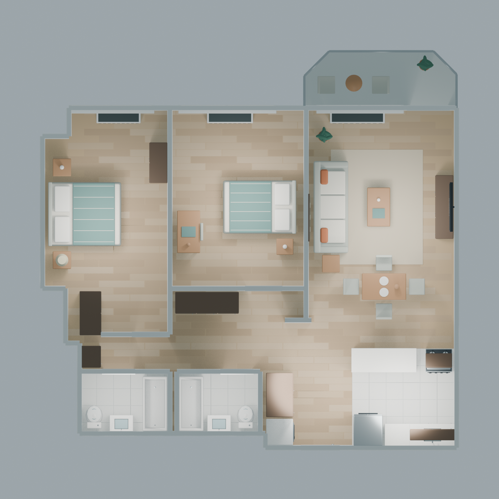
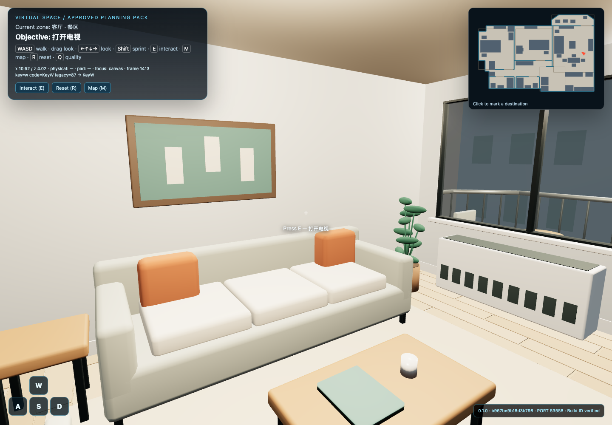
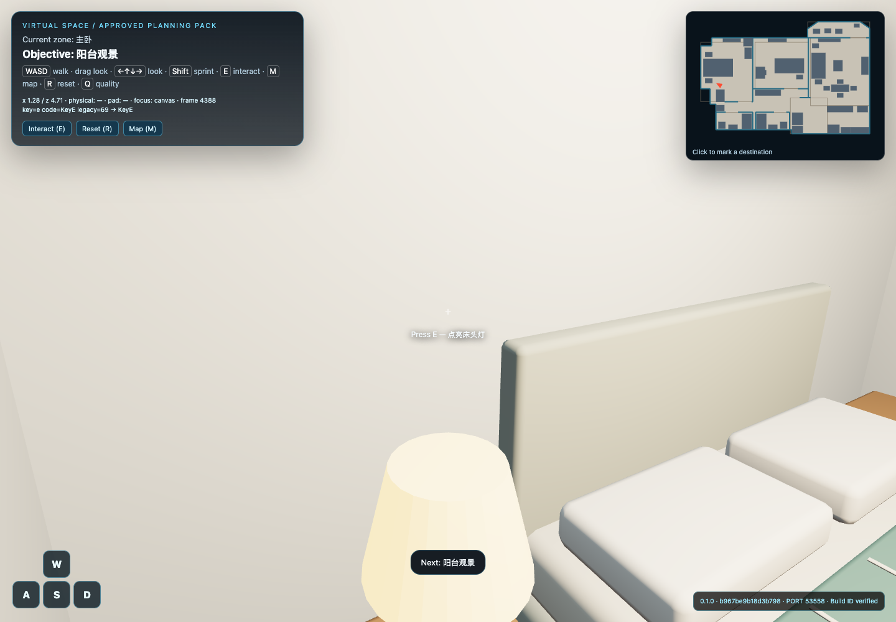

# Midtown apartment: the flagship case

A two-bedroom, two-bathroom apartment became a furnished desktop experience with
three light interactions and a verified, standalone ZIP. The owner supplied an
unscaled floor plan and six house-tour photos, described a Midtown-sized 2b2b, and
asked the agent to turn that intention into a complete project.



*Blender preview of the delivered model. See the browser capture below for the
actual gameplay presentation; the two renderers have different lighting.*

## Play it

From the repository root, run:

```sh
python3 scripts/replay_midtown.py --no-open
```

On Windows PowerShell, use `py -3 scripts/replay_midtown.py --no-open` instead.
Copy the full URL into Chrome, click Enter, and keep the terminal open. WASD walks,
mouse drag or arrows look, E interacts, and R resets. Follow **TV → primary-bedroom
lamp → balcony**. Ctrl+C stops the local server.

Only Python 3.10+ and a desktop WebGL browser are needed to replay. No AI model,
Blender, Node, paid asset service, or account is involved in replaying this ZIP.
The Windows recipe is provided but has not received Windows acceptance testing.
New to terminals? Use the [14-step guide](../../docs/getting-started.md).

## What was produced



- Eight visitable areas: primary bedroom, secondary bedroom, living/dining area,
  two bathrooms, foyer, kitchen and balcony.
- 43 furniture groups: beds, storage, sofa, TV, dining/coffee tables, desk/chair,
  kitchen appliances/cabinets, washrooms, laundry, plants and balcony seating.
- One self-contained GLB with 167 exported mesh objects and 89,740 triangles.
- Explicit movement barriers, open interior doorways and a closed entrance door;
  the player starts inside the foyer.
- Ordered interactions, visible TV/lamp emissive feedback, completion and full reset.
- Editable [Blender master](model/apartment.blend), [local generator](model/build_apartment.py),
  [layout data](model/layout-build.json), [reference planning](planning.reference.json),
  exported [GLB](assets/apartment.glb), and [playable ZIP](midtown-playable.zip).

## From intention to an actual delivery

The agent first separated the user's wishes, visible photo observations and unknown
measurements. It proposed an 11.7 × 9.6 metre indoor bounding box with a 2.65 metre
ceiling, retained the room relationships, furnished the rooms and showed a V1 plan.
The owner accepted that concrete version. These remain design estimates, not a
measured floor area or a claim about a statistical average Manhattan apartment.

Construction exposed a blocked secondary-bedroom route. The chair was tucked
under the desk, and an inaccessible equipment gap was removed from standing space.
After correction all 873 navigation samples were connected. The model's open
doorways were separately checked against actual triangles, then a browser walker
visited every room's access point and completed the game twice with reset between.



*Actual Chrome gameplay capture, with the scene loaded and player controls active.*



*Visible material feedback after the bedroom objective. This is emissive material
state, not a simulated electrical system or physically computed room illumination.*

## What the evidence means

The original commission was delivered as build `fba11bc23842a21a`. This public
replay uses rewritten public provenance instead of private approval records, so it
has a separate build identity: **`b967be9b18d3b798`**. The geometry, navigation,
runtime and gameplay remain the same. The launcher includes the Finder `.DS_Store`
fix, which ignores unmanifested Finder metadata while retaining game-file checks.

[replay.json](replay.json) binds the bundled ZIP to its identity and checksum.
[Public verification](evidence/public-verification.json) records the public
build's actual original/extracted tests. The two historical browser reports
([original](evidence/original-browser.json), [extracted](evidence/extracted-browser.json))
remain labelled with the original commission ID; they are not silently renamed
as new-build evidence.

The acceptance sequence checks keyboard movement, every room access point, an
actual stop at a structural wall, early/repeated interaction behavior, wall-blocked
interaction, ordered completion, reset and a second complete playthrough. Bed,
sofa, wardrobe and balcony exterior are also checked through navigation predicates;
this does not mean every furniture surface was physically walked into. Automated
steering controls yaw; translation uses normal keyboard input and collision logic.

The [geometric audit](evidence/geometry-review.json) contains 72 sampled rays across
six openings: five intended open doorways were clear, and the entrance remained
closed. Those results concern the unchanged original GLB. Public layout metadata
has been rewritten; its new hash is recorded separately from the historical audit
input. A top-down render includes lintels above doors and is not a construction plan.

## Modify or learn from it

The demonstration's confirmation flags apply only to this unchanged example.
They do not approve your home, dimensions or gameplay. For a new project, open
the repository in your coding agent and use the [starting brief](../../docs/getting-started.md#7-give-the-agent-the-starting-brief).
The agent should initialize a new project, gather your evidence and prepare a
specific revision for your review.

The generator reads `model/layout-build.json`. With Blender installed, generate
into a **new** output directory from the repository root:

```sh
blender --background --python examples/midtown-apartment/model/build_apartment.py -- --output projects/midtown-model-study --renders
```

Use your Blender executable's full path if `blender` is not on PATH. The master was
created with Blender 5.2.2 LTS. Generation is local; exported byte identity can vary
with the modelling environment. To change navigation or objectives, ask the agent
to adapt `planning.reference.json`, select/hash the new GLB, and run the regular
plan → approval → build → verification workflow. Do not edit an immutable playable's
runtime files and bypass its integrity check.

`answers.example.json` is demonstration input, not new-user testimony. Original
photographs, original plan pixels, private approval records and raw conversation
or token logs are not distributed. The `.blend`, generator, layout and GLB provide
the editable source for the authored scene; the bundled ZIP provides the runtime.

## Time, usage and limits

[Actual resource accounting](../../docs/resource-budget.md) records **18,136,004
model tokens** through first delivery, mostly cached input, plus the later launch
repair separately. It includes first-run harness engineering and retries. Complete
active project time was not captured; the final **3m 40s** measurement describes
verification only. Replaying the result consumes no agent tokens. These are measured
case facts, not a prediction or price quote for another project.

This is a single-floor desktop prototype with authored geometry and materials;
it is not photogrammetry, a surveyed property, or a reconstruction of an exact city
address. Most furniture is decorative; the three stated targets provide gameplay.
Windows, Safari, mobile/headsets and human physical-keyboard acceptance remain
unverified for the apartment. See the [root notices](../../THIRD_PARTY_NOTICES.md)
for source and license scope.
